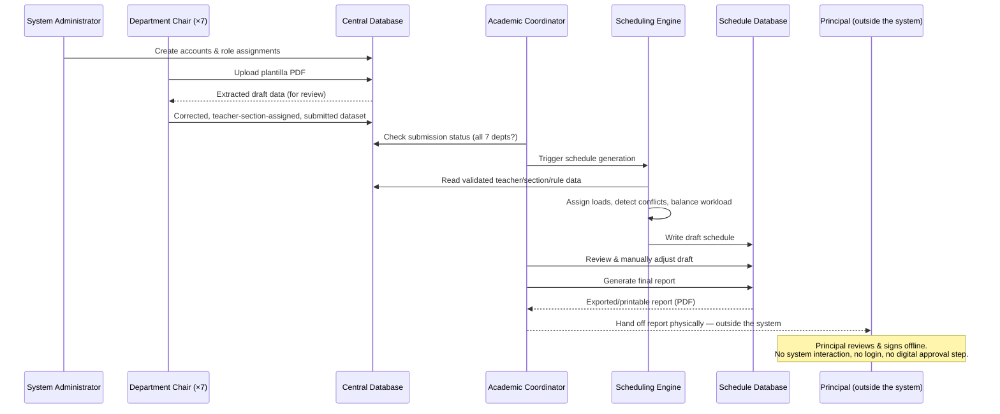

# JHS Teaching Load & Scheduling System — Software Requirements Specification

Status: **Draft v0.2**, derived from the plantilla data analysis in [[JHS Scheduling Constraints]] and the department/section directories, plus the workflow description supplied by the project owner (2026-08-04). Scope is JHS only, per the existing prioritization decision.

**v0.2 change (2026-08-04):** Role set finalized to exactly three system roles — System Administrator, Department Chair, Academic Coordinator. The Teacher role and Principal/Approver role proposed in v0.1 are removed. The Principal is explicitly **not a system user**; approval happens outside the system entirely, after the Academic Coordinator generates and exports the final schedule as a report. See §3 and §4 for the revised model.

---

## 1. Purpose & Scope

This SRS defines the users, access control model, and end-to-end process flow for a system that: (1) lets each JHS department digitize and maintain its own Plantilla (teaching-load) data, (2) centralizes that data for institutional review, and (3) automatically generates a draft schedule for Academic Coordinator review, culminating in an exported report used for offline Principal approval.

Out of scope for this draft: Grade School, financial/payroll processing (Equivalent Hours and Honoraria are tracked for scheduling purposes only, not computed for pay), any in-system login or workflow step for the Principal, and student/teacher-facing self-service features.

---

## 2. Actors

| Actor | Human role | System role |
|---|---|---|
| System Administrator | IT/registrar staff | Manages accounts, roles, and system configuration |
| Department Chair | One per department (7 in JHS: Filipino, CLE, TLE, Science, Mathematics, MAPEH, Social Studies) | Encodes/uploads their department's plantilla data; assigns teacher↔section load only |
| Academic Coordinator | AP for Academics (or delegate) | Reviews all department submissions, triggers schedule generation, reviews/adjusts the draft, and generates the final report |
| Scheduling Engine | System component, not a human user | Automated process — generates the draft schedule from submitted load data |
| Principal | Fr. Boholst or delegate | **Not a system user.** Reviews and signs the exported report entirely outside the system — no login, no in-system approval action. The system's responsibility ends at producing an accurate, presentable report. |

---

## 3. User Roles & Role-Based Access Control (RBAC)

### 3.1 Role definitions

**System Administrator**
- Creates, edits, deactivates user accounts for all other roles.
- Assigns/changes role and department affiliation per user.
- Configures system-wide constants (full load hours, hours/section per department, Service Load default, overload divisor, role→equivalent-hours lookup) once these are confirmed with stakeholders (see [[JHS Scheduling Constraints]] §5).
- Does **not** edit curriculum content, teaching loads, or generate schedules — separation of duties from the academic roles below.

**Department Chair**
- Scoped strictly to their own department (Filipino chair cannot see or edit CLE data, etc. — matches the "one department per teacher" exclusivity rule already observed in the source data).
- Uploads their department's Plantilla as a PDF; reviews/corrects the system's extracted data (see §6.2 on why review is mandatory, not optional).
- Manages subject offerings, teacher-to-section assignments, Class Moderator assignments for their own department's teachers, Honor's Class assignments (where applicable), Other Assignment/role entries, and Service Load overrides.
- Submits the completed department dataset to the Academic Coordinator for review — a discrete state transition (Draft → Submitted), not silent auto-sync.
- **Important boundary: a Department Chair assigns *who teaches which section* — that's it.** They do not assign class periods, time slots, days, or rooms, and they never touch another department's or another section's timetable. Producing the actual schedule (when/where each assignment happens, resolving conflicts, balancing load across the whole school) is exclusively the Scheduling Engine's job (§5.4), running only after all 7 departments submit. A Chair's output is *load data* (teacher × section × department), not a *schedule* — those are two different artifacts in this system, and the UI/permissions must keep that boundary visible so Chairs don't expect to see or set actual class times.

**Academic Coordinator**
- Read access across all departments once submitted.
- Validates completeness (all 7 departments submitted) and data-quality flags raised by the system (e.g. hour-total mismatches, teachers with zero sections, missing Service Load).
- Triggers the Scheduling Engine run once all departments are in.
- Reviews the generated draft schedule and can manually reassign/override entries.
- Once satisfied, generates the **final report** — the system's terminal action. There is no in-system approval step after this: the Coordinator exports/prints the report and hands it to the Principal physically, exactly as the current paper plantillas already flow to "Approved by: FR. ROBERTO M. BOHOLST, SJ." The system may optionally let the Coordinator mark a schedule "Presented to Principal" and later "Externally Approved" purely as a status label for their own tracking — this is a note-to-self field, not an authorization gate, since the Principal never interacts with the system.
- Cannot edit a department's raw plantilla data directly — must request the change back to that Department Chair, preserving accountability for source data.

There are exactly three system roles: **System Administrator, Department Chair, Academic Coordinator.** No Teacher role and no Principal/Approver role exist in the system — this supersedes the v0.1 draft's recommendation to add them.

### 3.2 RBAC permission matrix

| Permission | System Admin | Dept Chair (own dept) | Academic Coordinator |
|---|:---:|:---:|:---:|
| Create/edit/deactivate user accounts | ✅ | — | — |
| Assign roles & department affiliation | ✅ | — | — |
| Configure system constants (load hours, divisors, role→hours lookup) | ✅ | — | — |
| Upload/replace own department's plantilla PDF | — | ✅ | — |
| Edit own department's teachers, sections, subject assignments (*load data only*) | — | ✅ | — |
| Edit own department's Class Moderator / Honor's Class / Other Assignment entries | — | ✅ | — |
| Assign/edit class periods, time slots, days, or rooms (*timetable data*) | — | — | — |
| Submit department dataset for review | — | ✅ | — |
| View own department's data | — | ✅ | ✅ |
| View all departments' submitted data | — | — | ✅ |
| Edit another department's data | — | — | — |
| Flag/return a department's submission for correction | — | — | ✅ |
| Trigger Scheduling Engine run | — | — | ✅ |
| View generated draft schedule (all depts) | — | — | ✅ |
| Manually override/reassign a generated schedule entry | — | — | ✅ |
| Generate final report (for offline Principal review) | — | — | ✅ |
| Mark schedule "Presented" / "Externally Approved" (tracking label only) | — | — | ✅ |
| View system audit log | ✅ | — | ✅ (own dept actions) |

No role other than System Administrator can manage accounts; no role other than the owning Department Chair (or Admin acting on their behalf) can edit that department's source data — this preserves the "one teacher, one department" and "chairs own their own data" boundaries already implicit in how the paper plantillas are prepared and signed off.

Note the "Assign/edit class periods, time slots, days, or rooms" row has no ✅ anywhere — that's intentional, not an oversight. No human role directly authors the timetable; it is exclusively produced by the Scheduling Engine (§5.4) from the load data the Chairs submit, and the Coordinator's "Manually override/reassign" permission is the only human touchpoint on the generated result, not on original assignment. Likewise, "Approve/reject" no longer appears as a system permission at all — approval is a real-world action the Principal takes on a printed/exported document, outside any role or login this system defines.

---

## 4. Suggested Workflow

### 4.1 Narrative

1. **Account provisioning.** The System Administrator creates accounts for the Academic Coordinator and each of the 7 Department Chairs, assigning each the correct role and — for Chairs — department scope. No account is ever created for the Principal.
2. **Plantilla ingestion.** Each Department Chair uploads their department's plantilla as a PDF. The system extracts teacher names, sections, hours, moderator/Honor's Class assignments, and other-assignment roles from the PDF (see §6.2 for why this step needs a mandatory human review gate, based on extraction issues actually observed across the 7 existing plantilla PDFs).
3. **Chair review & correction.** The Chair reviews the system's extracted data against their source document, corrects any misreads, fills in canonicalized fields (e.g. employment status mapped to the fixed enum), assigns which teacher covers which section, and submits. The Chair never touches a period/time/room field — that data doesn't exist yet at this stage.
4. **Coordinator validation.** The Academic Coordinator monitors submission status across all 7 departments. Once all are submitted, the Coordinator reviews for completeness and data-quality flags (e.g. a teacher whose stated total doesn't match the computed formula — a real, currently-unresolved discrepancy in at least the Mathematics and CLE sheets).
5. **Schedule generation.** The Coordinator triggers the Scheduling Engine, which reads the validated data from the Central Database and produces: consolidated teaching-load assignments per teacher, a list of detected conflicts (e.g. a section double-booked within a department, a teacher over/under 21h without a flagged reason), and workload-balance flags — all constrained by department affiliation, hours/section rates, Honor's Class eligibility, and the 21-hour full-load baseline. This is the step that actually "does the scheduling" — the Chairs only ever supplied inputs to it.
6. **Draft storage.** The generated draft is written to the Schedule Database, in an editable draft state — not auto-published.
7. **Coordinator review & report generation.** The Academic Coordinator reviews the draft, makes manual adjustments where needed, and — once satisfied — generates the final report: a formatted, exportable/printable document (mirroring the existing plantilla's "Prepared by / Noted by / Approved by" layout).
8. **Approval — outside the system.** The Coordinator hands the printed or exported report to the Principal. The Principal reviews and signs it entirely outside the system. The system has no login, no approval action, and no status field that requires the Principal's participation — its job is done once the report is accurate and generated. The Coordinator may optionally flip a "Presented" / "Externally Approved" label for their own recordkeeping, but this is not an authorization gate.

### 4.2 Actors and data flow

---

## 5. Functional Requirements by Module

**5.1 User & Access Management** (System Admin)
- FR-1: The system shall support creating, editing, and deactivating accounts with exactly one role and, for Department Chair, exactly one department.
- FR-2: The system shall prevent a Department Chair account from reading or writing another department's data.
- FR-3: The system shall log all account and role changes with timestamp and actor.

**5.2 Plantilla Ingestion & Curriculum Management** (Department Chair)
- FR-4: The system shall accept a PDF upload per department and attempt structured extraction of: teacher name, employment status, sections taught per grade level, Class Moderator assignment, Honor's Class assignment (where the department's sheet has that column), Service Load, Other Assignment role(s) and their equivalent hours, and computed totals as stated on the sheet.
- FR-5: The system shall present extracted data to the Chair in an editable review screen before it is considered authoritative — **never auto-commit PDF-extracted data without human confirmation** (see §6.2).
- FR-6: The system shall canonicalize employment status to a fixed enum (`Permanent`, `Probationary 1–3`, `Substitute`, `Retiree`), mapping source labels like "New Teacher" per the rule agreed with stakeholders.
- FR-7: The system shall distinguish equivalent-hours-bearing Other Assignment roles from Honorarium-only roles (an explicit flag on the Role entity, not inferred from a blank/zero value), and exclude Honorarium-only roles from load and overload calculations.
- FR-8: The system shall let a Chair mark their department's dataset "Submitted," locking it from further edits until returned by the Coordinator.
- FR-8a: The system shall restrict a Department Chair's edit surface to teacher↔section↔department load data only. No Chair-facing page shall expose period, time-slot, day, or room fields — that data doesn't exist until the Scheduling Engine (§5.4) generates it, and it is never Chair-editable even after generation.

**5.3 Coordination & Validation** (Academic Coordinator)
- FR-9: The system shall show submission status for all departments and block schedule generation until all required departments have submitted (or the Coordinator explicitly overrides, with a logged reason).
- FR-10: The system shall flag rows where stated Total Teaching Hours doesn't match `(sections × dept. hrs/section) + moderator hrs + Honor's Class hrs`, for Coordinator or Chair review rather than silently accepting either value.
- FR-11: The system shall let the Coordinator return a department's submission with comments for correction.

**5.4 Scheduling Engine**
- FR-12: The engine shall assign at most one subject teacher per (Section × Department), and enforce that a teacher's subject-teaching load stays within their own department.
- FR-13: The engine shall enforce exactly one Class Moderator per Section, drawn from any department.
- FR-14: The engine shall compute Total Teaching Hours, Total Non-teaching Hours, Total Number of Hours, and Overload (in units) per the formula in [[JHS Scheduling Constraints]] §3, using the confirmed divisor once stakeholders finalize it (currently inferred as ÷3, unconfirmed).
- FR-15: The engine shall detect and report conflicts: double-booked sections, teachers below/above the 21h baseline without a flagged exception, and Honor's Class hours assigned outside the departments where that column exists.
- FR-16: The engine shall write output as an editable draft, never a final, auto-published schedule.

**5.5 Review & Report Generation**
- FR-17: The system shall let the Coordinator edit individual draft assignments, with each change logged.
- FR-18: The system shall generate a formatted, exportable/printable report of the finalized schedule (mirroring the existing plantilla's "Prepared by / Noted by / Approved by" sign-off layout, with the Principal's line left blank for a physical signature). This report is the system's terminal artifact — there is no digital approval step after it.
- FR-19: The system shall let the Coordinator optionally mark a report "Presented to Principal" and "Externally Approved" as tracking labels only. These labels shall not gate any further system behavior or visibility — no permission check may depend on them.

---

## 6. Non-Functional Requirements & Design Notes

**6.1 Security / separation of duties.** Role boundaries in §3 should be enforced at the data layer, not just hidden in the UI — a Chair's API access should be scoped server-side to their own department, since the source data model treats department affiliation as an exclusivity constraint.

**6.2 PDF ingestion is a known reliability risk — build for it, don't assume clean extraction.** This SRS's own supporting research extracted all 7 current plantilla PDFs with a standard text-extraction tool, and found meaningfully inconsistent results even on already-finalized, human-prepared sheets: grade-level column alignment was ambiguous in at least 2 of 7 sheets (CLE, MAPEH), merged/wrapped cells scrambled section-name groupings in several sheets, and numeric totals didn't always land in a machine-parseable position. If real plantillas already produce this much extraction ambiguity, the system must never treat OCR/PDF-extracted data as final without the mandatory Chair review step (FR-5). Consider whether a structured web form (mirroring the plantilla's fields) should be the primary encoding path, with PDF upload as a convenience import that pre-fills the form for review rather than the sole entry method.

**6.3 Auditability.** Every write to teacher-load data (Chair edits, Coordinator overrides, Engine-generated assignments) should be attributable and timestamped — administrators are expected to "review, modify, and approve," which implies a change history, not just a final snapshot.

**6.4 Section identity.** Sections must be modeled as (grade, name) pairs, not name alone — the same name (e.g. "Xavier," "Ignatius") legitimately recurs as a distinct section in different grade levels. Getting this wrong will silently merge unrelated sections across grades.

**6.5 Configurable constants.** Hours/section (4 vs 5), the overload divisor, and the role→equivalent-hours lookup table should be admin-configurable data, not hard-coded, since at least the divisor is currently unconfirmed and the hours/section rate already varies by department.

---

## 7. Directory Architecture

**Superseded by [[JHS Laravel System Architecture]].** The stack is now decided — Laravel + Blade + a relational (SQL) database, using a Layered Architecture + Service Layer pattern. The generic, framework-agnostic structure previously sketched here (separate `apps/web` SPA + `apps/api`, two databases) no longer applies: Laravel is a monolith by convention (server-rendered Blade views, one relational database), and the linked document gives the concrete `app/` folder layout, layer responsibilities, database schema, and request-flow walkthroughs. Read that document alongside this SRS; this section is kept only as a pointer.

---

## 8. System Pages Needed

Page inventory by role, cross-referenced to the RBAC matrix in §3.2 and the functional requirements in §5. "Shared" pages are visible to more than one role with role-appropriate scoping.

### 8.1 Shared / Auth
| Page | Purpose | Roles |
|---|---|---|
| Login | Authentication entry point | All |
| My Profile | View/edit own account details, change password | All |
| Notifications / Inbox | Submission status changes, return-for-correction comments, approval results | Dept Chair, Academic Coordinator, Approver |

### 8.2 System Administrator
| Page | Purpose | FR ref |
|---|---|---|
| User Directory | List/search all accounts across roles and departments | FR-1 |
| Create/Edit User | Assign role, and department (for Chairs) | FR-1, FR-2 |
| Deactivate/Reactivate User | Suspend access without deleting history | FR-1 |
| System Constants Config | Edit hrs/section per department, full-load hours, overload divisor once confirmed | §6.5 |
| Role → Equivalent Hours Lookup | Maintain the Other Assignment role table (Dept Chair, Coordinator, GLL, etc.) and Honorarium-only flags | FR-7 |
| Audit Log Viewer | Full system-wide change history | FR-3, §6.3 |

### 8.3 Department Chair

**Answering open question — "Each department chair gets their own dashboard?" Yes.** Since RBAC scopes every Chair to their own department only (§3.2 — a Filipino chair can't see CLE data, etc.), "Department Dashboard" below is not one shared page; it's the same page template rendered per-Chair with their department's data injected server-side. There are effectively 7 dashboard instances, one per department, not a single shared view with filters — this matters for the architecture (§7) because it means the dashboard route must resolve the requesting Chair's department server-side rather than accept a department parameter from the client.

| Page | Purpose | FR ref |
|---|---|---|
| Department Dashboard | Submission status, teacher count, open data-quality flags — scoped to that Chair's own department only | — |
| Upload Plantilla | PDF upload for their department | FR-4 |
| Plantilla Review & Correction | Editable grid of extracted data (teacher, sections, hours, moderator, HC, Service Load, Other Assignment) for confirmation before submission | FR-5, FR-6, FR-7 |
| Teacher Roster (own dept) | List of teachers in the department with employment status | FR-6 |
| Section Assignment Editor | Assign *which teacher teaches which section* — load data only, no periods/times/rooms (see FR-8a) | FR-4, FR-8a |
| Class Moderator / Honor's Class Editor | Assign CM and HC where applicable | FR-4 |
| Submit for Review | Final review screen + submit action, locks editing | FR-8 |
| Returned Submissions | View Coordinator's comments on a returned dataset and re-edit | FR-11 |

### 8.4 Academic Coordinator

**Answering open question — "What type of pages for viewing does the AC get?"** The Coordinator is the only role with read access across *all* departments at once (§3.2), so their page set splits into two families: (a) **submission/administrative views** — tracking whether each department has done its data-entry job, and (b) **cross-department analytical views** — seeing the whole school at once in ways no single Department Chair can, since a Chair only ever sees their own department. Both families are listed below; the analytical ones (Master Teacher Directory onward) are new relative to the previous draft and specifically fill the "what can the AC actually look at" gap.

**(a) Submission / administrative views**

| Page | Purpose | FR ref |
|---|---|---|
| All-Departments Dashboard | Submission status across all 7 departments, at a glance | FR-9 |
| Department Data Viewer (read-only) | Drill into any single department's submitted data, as that Chair sees it | — |
| Data-Quality Flags | Hour-mismatch rows, zero-section teachers, missing Service Load, etc., across all departments | FR-10 |
| Return Submission | Send a department's dataset back with comments | FR-11 |

**(b) Cross-department analytical / viewing pages**

| Page | Purpose | FR ref |
|---|---|---|
| Master Teacher Directory | Every JHS teacher, searchable/filterable across all 7 departments at once (status, department, load) — the AC's equivalent of [[JHS Department Directory]], but live | — |
| Master Section Directory | Every section across all 4 grade levels with its teacher per department and Class Moderator — the AC's equivalent of [[JHS Sections Directory]], but live and validated (not the extraction-caveated version) | — |
| Workload / Overload Analytics | School-wide view of who's under, at, or over the 21h full load, and by how much — sortable by department, useful for spotting imbalance before generation | FR-14 |
| Honorarium vs. Equivalent-Hours Report | Cross-department view separating load-bearing Other Assignments from Honorarium-only roles, for the "who's compensated how" picture (§3.1's separation-of-duties note applies — this is a viewing report, not a payroll action) | FR-7 |

**(c) Schedule-generation & review views**

| Page | Purpose | FR ref |
|---|---|---|
| Trigger Schedule Generation | Kick off the Scheduling Engine once all departments are in (or override, with logged reason) | FR-9, FR-12–FR-16 |
| Draft Schedule Review | Full generated schedule, editable, with conflict/overload flags surfaced inline | FR-15, FR-17 |
| Manual Reassignment Editor | Override a specific teacher-section-moderator assignment in the draft — still not a period/room editor unless that's added to scope later | FR-17 |
| Schedule Version History | Compare the current draft against a prior generation run or a previously approved SY schedule | §6.3 |
| Generate Final Report | Produce the printable/exportable report (mirrors the "Prepared by / Noted by / Approved by" sign-off layout already used on the paper plantillas, Principal's line left blank for physical signature) | FR-18 |
| Mark Presented / Externally Approved | Optional tracking-only status labels set by the Coordinator after the physical handoff — not an authorization gate | FR-19 |

There is no Principal-facing or Teacher-facing page anywhere in this system — those roles don't exist (§2, §3.1).

---

## 9. Open Questions / Assumptions to Confirm with Stakeholders

### Resolved this round (2026-08-04)

- ~~Each department chair gets their own dashboard?~~ **Yes** — one dashboard template, 7 department-scoped instances, server-side scoped to the logged-in Chair's department (§8.3).
- ~~What type of pages for viewing does the AC get?~~ **Answered in §8.4**, split into submission/administrative views, cross-department analytical views (Master Teacher/Section Directory, Workload Analytics, Honorarium report), and schedule-generation/review views.
- ~~Does the Department Chair assign the schedule?~~ **No** — confirmed: Chairs assign teacher↔section load data only (who teaches what). Class periods, time slots, days, and rooms are generated exclusively by the Scheduling Engine; no human role directly authors the timetable (§3.1, FR-8a, RBAC matrix note in §3.2).
- ~~Are Teacher and Principal/Approver in-system roles?~~ **No, on both.** Finalized: exactly three roles (System Admin, Department Chair, Academic Coordinator). The Principal is explicitly outside the system; approval happens on the exported report, offline. This supersedes the v0.1 recommendation to add both roles.
- ~~Does the Academic Coordinator approve schedules directly, or only recommend to the Principal?~~ **Neither, exactly** — the Coordinator's system role ends at generating the report (FR-18); actual approval is a real-world act the Principal takes on paper, with no digital counterpart.

### Still open

- **Overload divisor, Service Load waiver conditions, and the Mathematics total-hours discrepancy** are all still open per [[JHS Scheduling Constraints]] §5 and directly affect FR-10 and FR-14 — these need registrar/department-chair confirmation before the Scheduling Engine's formulas can be finalized.
- **Grade 10 data completeness** (see [[JHS Sections Directory]] — Grade 10 section) needs to be resolved before FR-12/FR-13 can be trusted for that grade level.
- **Tracking-only "Externally Approved" label (FR-19):** confirm whether the Coordinator even wants this bookkeeping step, or if leaving it out entirely (report generation is the last system action, full stop) is simpler and preferred.
